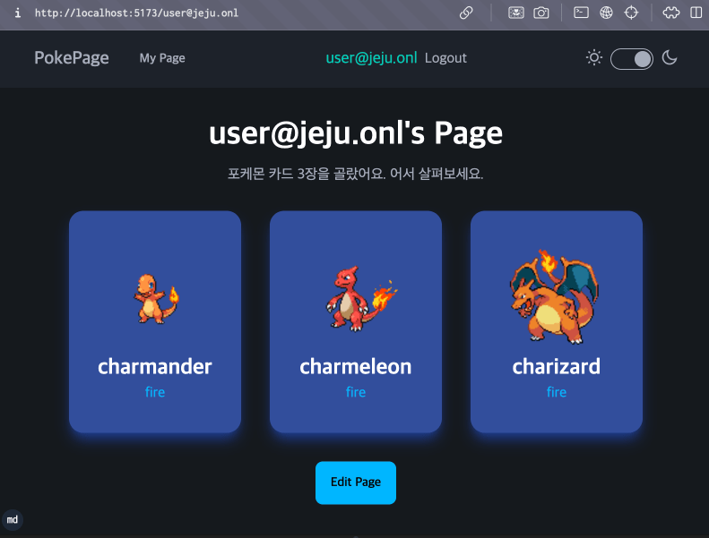
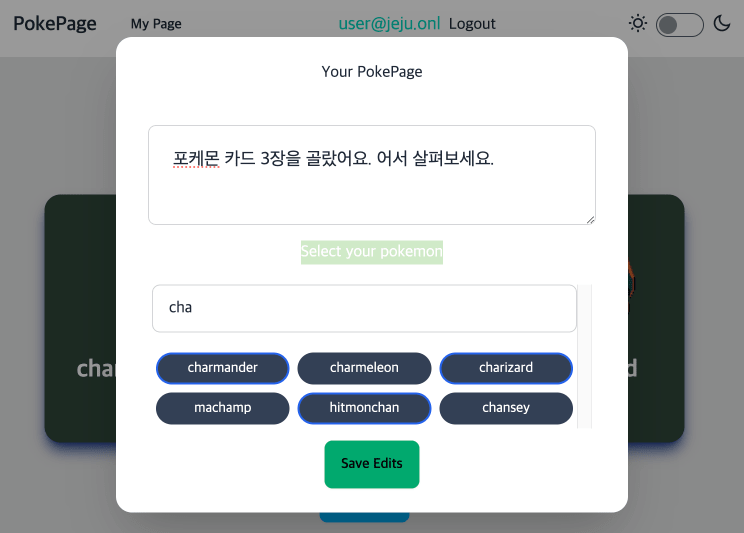
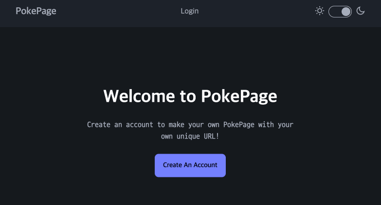
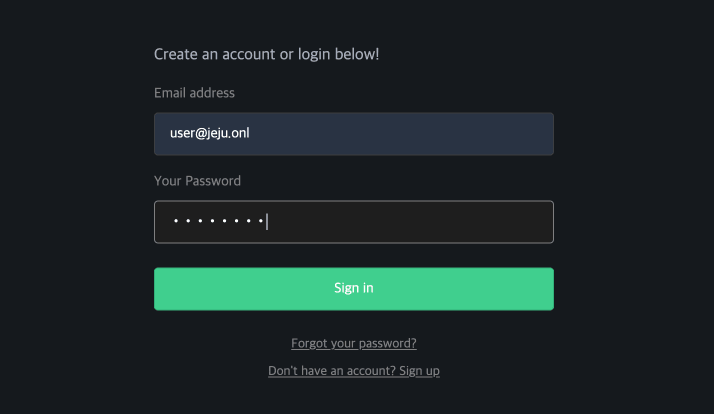

# svlt5-pokepage

출처 : [SvelteKit & Supabase Project Build #1 - Intro & Setup](https://youtu.be/JZRzP5QFXV8?si=yB8KfQHV-nFYdtxh)

> 설치 및 실행

```bash
cd svlt5-pokepage
bun install

bun --bun run dev --host 0.0.0.0
```

## 개요

[pokeapi.co](https://pokeapi.co) 에서 제공하는 포켓몬 API 를 사용하여 사용자별 MyPage 에서 자신의 포켓몬 카드 3장과 코멘트를 조회하고 수정할 수 있다.

### Features

- 홈페이지 : top 메뉴, 메인 섹션
  - 로그인 하면 사용자 email 출력 및 메뉴 변경
  - daisyUI 의 light/dark 테마 변경 (custom 색상 추가)
- 로그인페이지 : supabase ID/PW
  - 로그인 하면 홈페이지로 이동
- 마이페이지
  - supabase 테이블에서 사용자 데이터 읽어오기
  - 화면에 사용자의 pokemon 카드 3장과 코멘트 출력
  - 전체 pokemon 카드 리스트에서 선택 및 코멘트 수정하여 DB 저장
  - 로그아웃 하면 홈페이지로 이동

### 화면캡쳐

> 마이페이지



> 마이페이지 : edit 다이얼로그



> 홈페이지



> 로그인페이지



## [Supabase SvelteKit Guide](https://supabase.com/docs/guides/auth/server-side/sveltekit)

출처에서는 hooks 을 사용하지 않고 client 의 LayoutData 를 이용하여 supabase.auth 와 session 을 사용하고 있다.

### [인증 아키텍처 (4계층)](https://supabase.com/docs/guides/auth/architecture)

1. 클라이언트 레이어 (SDK) : 브라우저 또는 백엔드에서 실행 가능
2. Kong API 게이트웨이 : 단순 전달
3. GoTrue (인증서비스) : JWT 검증과 발급, DB 또는 OAuth 에 대한 서비스 브로커
4. PostgreSQL 데이터베이스 : 사용자 테이블, RLS, 권한관리

#### [사용자 인증 방법](https://supabase.com/docs/guides/auth/users#the-user-object)

- 비밀번호 기반
- (비밀번호를 사용하지 않는) 이메일, 전화 기반
- OAuth
- SAML SSO

> ID 를 생성할 수 있는 수단 (ID 타입) : 사용자는 여러 ID를 가질 수 있음

- 이메일
- 핸드폰
- OAuth
- SAML

#### [인증을 위한 서버측 렌더링 (SSR)](https://supabase.com/docs/guides/auth/server-side/sveltekit)

> SSR 을 사용하는 이유

SSR 프레임워크는 렌더링 및 데이터 가져오기를 서버로 이동하여 클라이언트 번들 크기와 실행 시간을 줄입니다.

### supabase auth event 순서

`+layout.js` 로부터 생성된 LayoutData 는 `$props` 를 통해 전계층으로 전달된다.

- `depends('supabase:auth')` 선언된 부분만 invalidate 할 수 있다.
- LayoutData 도 반응형 전달체이기 때문에 `$effect` 로 변경 처리를 할 수 있다.
- AuthState 의 비동기 event 는 DOM 처리보다 뒤늦게 도착한다.
- onAuthStateChange 콜백은 ROOT js 또는 svelte 스크립트에서 설정한다.
  - 출처에서는 `+layout.svelte` 에서 했는데, `+layout.js` 에서 해도 된다.

> 첫페이지

HOME 상단메뉴에 login 버튼이 나타나고, 첫페이지 출력

1. ROOT `+layout.js` : createBrowserClient 호출하여 data 전달 (access_token)
2. ROOT `+layout.svelte` : onAuthStateChange 콜백 설정
3. HOME `+layout.svelte` : data 로부터 session 갱신
4. HOME `+page.svelte` : Login 버튼 출력 (session == null)
5. onAuthStateChange 콜백 : INITIAL_SESSION 이벤트 도착 (무반응)

> 로그인

로그인 입력폼에 ID/PWD 입력하면 user.email 이 표시된 첫페이지로 이동

1. HOME : login 버튼 클릭하여 login 페이지 이동
2. LOGIN `+page.svelte` : ID/PWD 입력 => AuthState 상태 변경
3. onAuthStateChange 콜백 : SINGED_IN event 수신 후 전계층 data 재전송
4. ROOT `+layout.js` : createBrowserClient 호출하여 data 전달 (access_token)
5. LOGIN `+page.svelte` : 변경된 data.session 로 인해 첫페이지 이동
6. HOME `+layout.svelte` : data 로부터 session, user.email 갱신
7. HOME `+page.svelte` : Login 버튼 없이 첫페이지 출력

> 로그아웃

auth.signOut() 호출시 HOME 상단메뉴의 user.email 표시가 없어지고 Login 버튼 출력

1. HOME `+layout.svelte` 상단의 logout 클릭 => AuthState 상태 변경
2. onAuthStateChange 콜백 : SINGED_OUT event 수신 후 전계층 data 재전송 (또는 페이지 이동)
3. HOME `+layout.svelte` : data 로부터 session 갱신 (session == null)

## Svelte 5 preview

### side effect 순서

사용자 경험을 높이기 위해 button 의 DOM 렌더링 전에 session 을 갱신했다.

1. `$effect.pre` : DOM 의 beforeUpdate (ex: autoscroll 상태값)
2. `onMount` : 컴포넌트가 DOM 에 mount 될 때 한번만 실행
3. `$effect` : DOM 의 afterUpdate (ex: autoscroll 상태 변경에 대한 반영)

```html
<script>
  let { children, data } = $props();
  let supabase = $state(data.supabase);
  let session = $state(data.session);

  // DOM 업데이트 이전에 실행 ($effect 는 이후에)
  $effect.pre(() => {
    console.log('layout: beforeUpdate');
    supabase = data.supabase;
    session = data.session;
  });
</script>

<div>
  {#if session == null}
  <button onclick="{()" ="">goto('/login')}>Login</button>
  {:else}
</div>
```

#### 참고사항

- `$derived` 는 `$state` 변수에 대한 반응성을 연결하는데 사용된다.
  - `$state` 없이 `$props` 파생 변수를 처리할 수 없다.
  - `$derived` 는 `$effect` 블록을 변수 단위로 적용한 것과 같다.

## Database

```sql
-- 1. Create table
drop table if exists pokemons;

create table pokemons (
  id bigint generated by default as identity primary key,
  user_id uuid references auth.users on delete cascade,
  email text,
  comment text,
  pokemon_ids integer[]  -- '{1,2,3}'
);

-- 1-1. check user_id by email
do $$
declare
  user_email text := 'user@jeju.onl';
  user_id uuid;
begin
  select id into user_id from auth.users where email = user_email;
  raise notice 'ID of user "%" = "%"', user_email, user_id;
end; $$;

-- 1-2. insert sample data
insert into pokemons (user_id, email, comment, pokemon_ids) values(
  (select id from auth.users where email = 'user@jeju.onl'),
  'user@jeju.onl',
  '내가 좋아하는 개구리 포켓몬 3마리를 골랐어요.',
  '{1,2,3}'
);

-- 1-3. select sample data
select * from pokemons;

-- 2. Enable RLS
alter table pokemons enable row level security;

-- 3. Create Policy : select
create policy "Public pokemons are visible to everyone."
on pokemons for select
to anon  -- the Postgres Role (recommended)
using ( true );

-- 또는 자기 데이터만 보이기
-- create policy "User can see their own profile only."
-- on profiles for select
-- using ( (select auth.uid()) = user_id );


-- 3. Create Policy : insert
create policy "Users can create a profile."
on profiles for insert
to authenticated  -- the Postgres Role (recommended)
with check ( (select auth.uid()) = user_id );

-- 3. Create Policy : update
create policy "Users can update their own profile."
on profiles for update
to authenticated                    -- the Postgres Role (recommended)
using ( (select auth.uid()) = user_id )
with check ( (select auth.uid()) = user_id );
```

## JS 스크립트

### `+page.svelte`

- LayoutData 로부터 supabase, session 가져오기
- MyProfile 인스턴스 생성
- `$state` : myProfile, myPokemons 선언
- onMount : loadProfile 으로 myProfile 갱신
- `$effect` : getPokemonData 으로 myPokemons 갱신
- Edit Button : 코멘트, 카드 3종 편집을 위한 다이얼로그 열기
- Pokemon Button : pickPokemon 으로 pokemon 카드 선택
- Save Button : saveProfile 실행과 다이얼로그 닫기

### pokemon API

[pokeapi.co](https://pokeapi.co) 에서 제공하는 포켓몬 API 를 사용한다.

- [getPokemonList](https://pokeapi.co/api/v2/pokemon?limit=151&offset=0)
- [getPokemonByName](https://pokeapi.co/api/v2/pokemon/pikachu)
- [getPokemonById](https://pokeapi.co/api/v2/pokemon/25/)

### MyProfile 클래스

supabase 의 사용자 데이터를 다루기 위한 모든 기능을 포함한다.

> 자료구조

- supabase 클라이언트
- profile = { user_id, email, comment, pokemon_ids }
- pokemons = { id, name, type, imgSrc }[]

> 메소드

- loadProfile : profile 읽기
- saveProfile : profile 저장
- getPokemonData : getPokemonById(pokemon_ids) 로 포켓몬 데이터 전달

### 생성자에서 async 함수 호출하기 (폐기)

이런 식으로 할 수도 있다는 의미로 기록만 해둔다.

생성자에서 async 를 호출하면 지연된 초기화가 이루어지기 때문에 권장하지 않는다. 하지만 꼭 필요한 경우 (수명주기에 따른) 초기화 메소드를 따로 정의하여 외부에서 비동기로 호출하도록 한다.

참고 : [The Proper Way to Write Async Constructors in JavaScript](https://dev.to/somedood/the-proper-way-to-write-async-constructors-in-javascript-1o8c)

> 포켓몬 프로파일 테이블을 읽어오는 코드 (생성자에서 Promise 사용)

```js
export class PokemonProfile {
  #supabase;
  /**
   * @type {{ userId: string, email: string, comment: string, pokemonIds: number[] } | null}
   */
  #profile;

  /**
   * @param {import('@supabase/supabase-js').SupabaseClient<any, "public", any>} supabase
   * @param {import('@supabase/supabase-js').Session} session
   */
  constructor(supabase, session) {
    this.supabase = supabase;
    const userEmail = session.user?.email;
    console.log(this.userEmail);

    // 생성자에서 async 함수 호출하기 (되도록 안쓰는게 좋다)
    return Promise.resolve(userEmail).then(email=>{
      this.#profile = await this.#loadProfile();
      return this;
    });
  }

  /**
   * [private] email 로 pokemon profile 을 읽어오기
   */
  async #loadProfile() {
    // Try to grab the current profile (coopercodes3@gmail.com)
    const { data: profileData, error: profileError } = await this.#supabase
      .from('pokemons')
      .select('user_id, email, comment, pokemon_ids')
      .eq('email', email);
    console.log(profileData);
    return profileData?.length > 0 ? profileData[0] : null;
  }

  /**
   * [readonly] pokemon 사용자 프로파일
   */
  get profile() { return this.#profile; }
}
```
